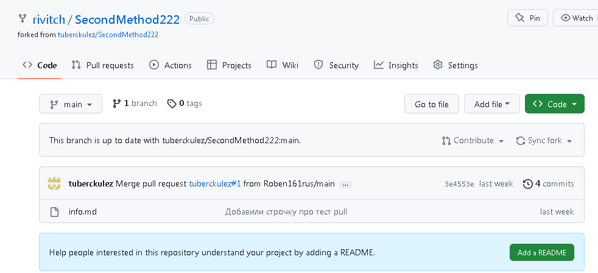
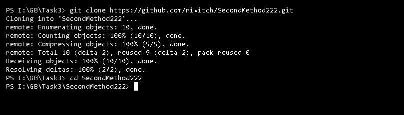
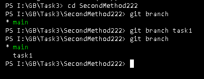
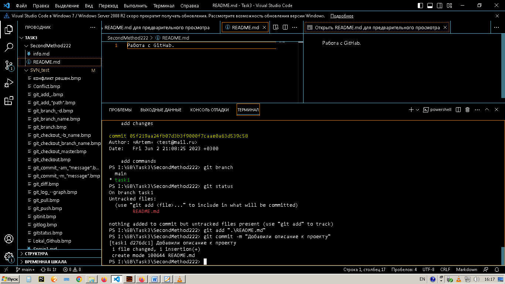

# Работа с GitHab.

1. Сохраняем чужой репозиторий кнопкой "fork"

2. Копирование в локальный репозиторий

3. Создание ветки

4. Переход в ветку и создание "README.md"

5. Отправка во внешний репо

