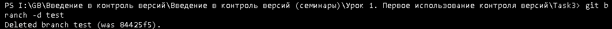
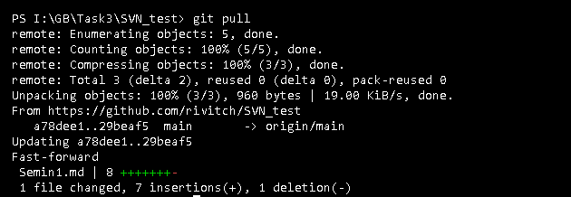
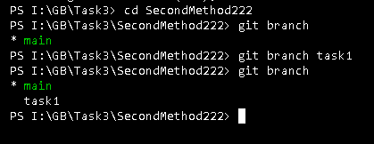

# Основные команды Git

**git init** – инициализация локального репозитория

**git status** – получить информацию от git о его текущем состоянии

**git add “path”**– добавить файл или файлы к следующему коммиту

**git add .**- добавляет все файлы в проекте в отслеживание

**git commit -am “message”** - git add + git commit (Работает только после 1-го ручного добавления в отслеживание)

**git commit -m “message”** – создание коммита

**git log** – вывод на экран истории всех коммитов с их хеш-кодами

**git checkout** – переход от одного коммита к другому

**git checkout master** – вернуться к актуальному состоянию и продолжить работу (git checkout main)

**git diff** – увидеть разницу между текущим файлом и закоммиченным файлом

## Работа с ветками

**git branch <название ветки>** – создать новую ветку

**git branch -d <название ветки>** – удалить ветку

**git branch** – посмотреть список веток в репозитории

**git checkout <название ветки>** – переход к другой ветке

**git checkout -b <название ветки>** -> Создание и переход в новую ветку

**git log --graph** - визуализирует коммиты

## Работа с удаленными репозиториями

**Команды синхронизации удаленного и локального репозиториев**

**git clone <url-адрес репозитория>** – клонирование внешнего репозитория на  
локальный ПК

**git pull** – получение изменений и слияние с локальной версией

**git push** – отправляет локальную версию репозитория на внешний репозиторий

## Работа с GitHab.

1. Сохраняем чужой репозиторий кнопкой "fork"

2. Копирование в локальный репозиторий

3. Создание ветки

4. Переход в ветку и создание "README.md"

5. Отправка во внешний репо

