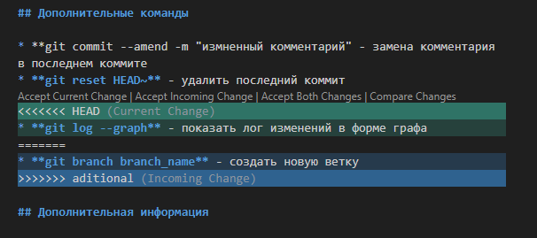
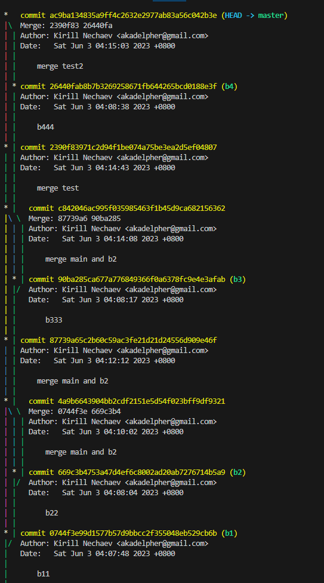
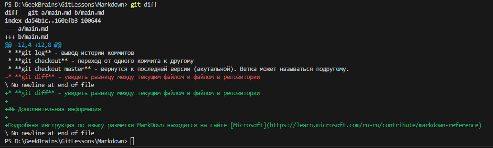

# Инструкция по работе с Git

## Основные команды GIT

* **git init** - инициализация локального репозитория (начало работы)
* **git status** - текущее состояние репозитория
* **git add "path"** - добавить файл к сохранению.
  * git add . - добавляет все файлы к сохранению  
  * git commit -am “message” - git add + git commit (Работает только после 1-го ручного добавления в отслеживание)
* **git add "path"**
* **git commit -m "message"** - создание коммита. Сохранение изменений в репозиторий.
* **git log** - вывод истории коммитов
* **git checkout** - переход от одного коммита к другому
* **git checkout master** - вернутся к последней версии (акутальной). Ветка может называться подругому.
* **git diff** - увидеть разницу между текущим файлом и файлом в репозитории

## Дополнительные команды

* **git commit --amend -m "измненный комментарий" - замена комментария в последнем коммите
* **git reset HEAD~** - удалить последний коммит
* **git log --graph** - показать лог изменений в форме графа
* **git branch branch_name** - создать новую ветку
* **git branch -d <название ветки>** – удалить ветку

## Работа с удаленным репозиторием

* **git clone** <url-адрес репозитория> – клонирование внешнего репозитория на  локальный ПК
*	**git pull** – получение изменений и слияние с локальной версией
*	**git push** – отправляет локальную версию репозитория на внешний
* **git remote add origin <remoteurl>** - Для сопоставления удаленного URL-адреса. Она связывает имя origin с URL-адресом REMOTE_URL

## Дополнительная информация

* Пример работы Git merge с конфликтом
 

* Пример работы Git log --graph
 

* Пример работы Git diff:

  

